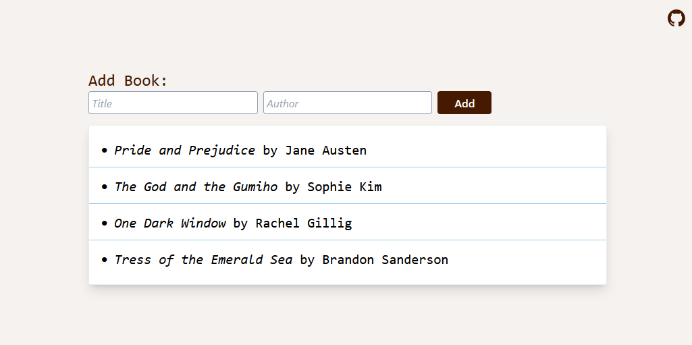

# Simple Book API



This is a simple full-stack web application for managing a personal book library. The project includes Node.js + Express REST API that lets you:

- Add new books

- Edit existing books

- Delete books

- List all books

## Getting Started

### Node Version Setup + Package Install

```sh
# Install node version from .nvmrc file
nvm install

# Use node version from .nvmrc file
nvm use
```

```sh
pnpm install
```

### Run Vue Frontend

```sh
pnpm run dev
```

### Run API Server

```sh
pnpm run backend
```

### Build

```sh
pnpm run build
```

### Build + Deploy

```sh
pnpm run deploy
```

## 🔜 To-Do

- Component tests
